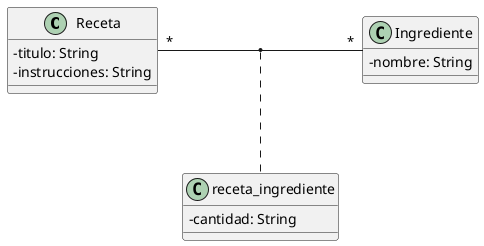

# Recetas

Crea una aplicación que permita mantener un recetario de cocina.

Cada receta estará compuesta de una lista de ingredientes (con una cantidad asociada a cada ingrediente) y de unas instrucciones de elaboración (un solo bloque de texto), siguiendo este diagrama de clases:

## Restricciones

- La base de datos puede ser MySQL o Oracle. Tú eliges.
- La aplicación tiene que tener un GUI basado en Swing como interfaz de usuario. El diseño es libre.
- La aplicación permitirá, por lo menos, crear y visualizar recetas e ingredientes. La edición y el borrado son opcionales. 
