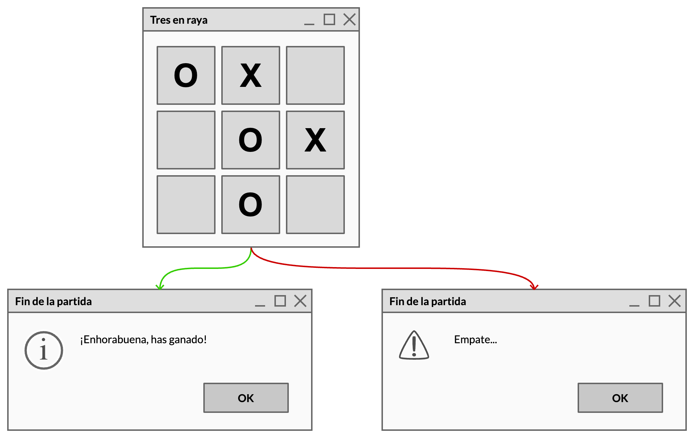
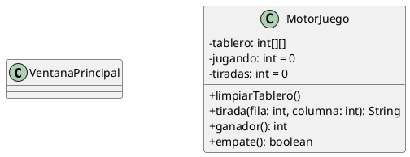

# Tres en raya

Crea el juego de tres en raya usando una ventana con botones para representar el tablero de modo que cuando el usuario haga click en un botón, el texto de ese botón cambie a una `X` o una `O`, dependiendo de a quién le toque jugar.

## Restricciones

El programa estará compuesto por dos clases:

- `VentanaPrincipal`: muestra el interfaz de usuario y contendrá la función `main()`. 
- `MotorJuego`: contendrá toda la lógica y las estructuras de datos necesarias para que funciones el juego.

Las propiedades de la clase `MotorJuego` son:

- `tablero`: almacena el estado del juego en un array de 3x3 enteros, representando al jugador `O` con un 0, al jugador `X` con un 1 y la casilla vacía con un -1.
- `jugando`: almacena quién está jugando en esta tirada, 0 o 1.
- `tiradas`: contador de tiradas (máximo 9).

Los métodos de la clase `MotorJuego` son:

- `reset()`: reinicia el array y las variables a sus valores iniciales.
- `tirada()`: recibe las coordenadas del tablero en las que ha hecho click el usuario y retorna la ficha correspondiente que hay que dibujar (`X` o `O`).
- `hayGanador()`: retorna `-1` si no hay ganador y `0` o `1` si gana `O` o `X`. 
- `empate()`: retorna `true` si se ha producido un empate.

## Reglas de juego

- Siempre comienza el jugador `O`.
- Cuando haya ganador o empate, se mostrará el mensaje correspondiente, se limpiará el tablero y volverá a comenzar el juego.
