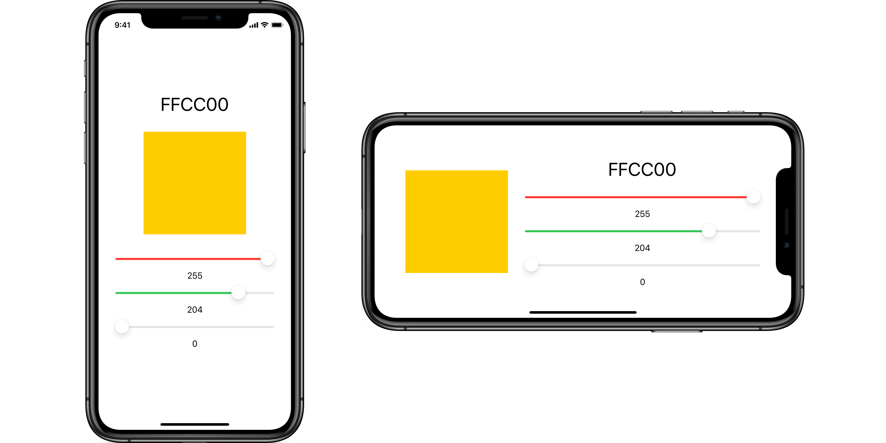

# ColorSelector

Crea un selector de colores RGB.

## Requisitos

El interfaz de usuario deberá tener este aspecto:

## Restricciones

Utiliza _stack views_ y crea las _constraints_ necesarias para que el interfaz sea lo más parecido posible al del ejemplo.

Usa _size classes_ para hacer que el interfaz se adapte correctamente cuando el dispositivo está en horizontal.

## Sugerencias

Para visualizar los números en hexadecimal puedes usar `String(format:)` como en [este ejemplo](https://stackoverflow.com/a/24229531/14378620).
