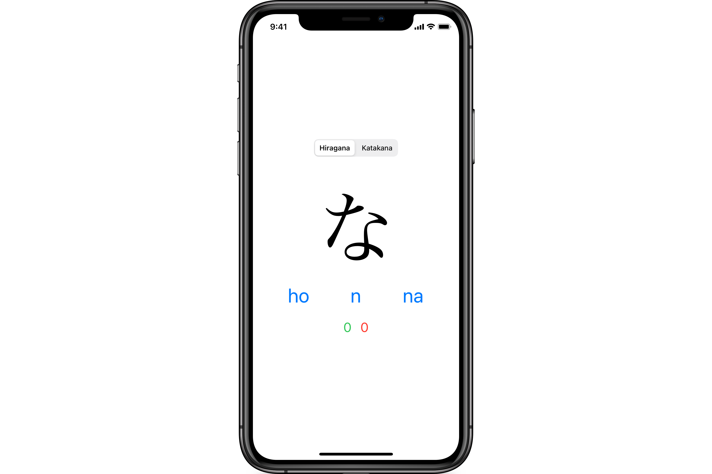

# KanaCards

Queremos crear una aplicación para aprender los Kana o [silabarios japoneses](https://es.wikipedia.org/wiki/Escritura_japonesa).

## Requisitos

El interfaz de usuario deberá tener este aspecto:

El programa se comportará de este modo:

- Al comenzar, mostrará un carácter y tres posibles transcripciones aleatorias en [_rōmaji_](https://es.wikipedia.org/wiki/Rōmaji).
- Al pulsar sobre una de ellas, incrementará el contador de correctas o incorrectas y mostrará otro carácter diferente.

## Notas

* En el fichero [`Silabarios.swift`](./KanaCards/KanaCards/Silabarios.swift) ya están incluidos los diccionarios con las correspondencias.
* Sólo vamos a desarrollar la orientación en vertical.
