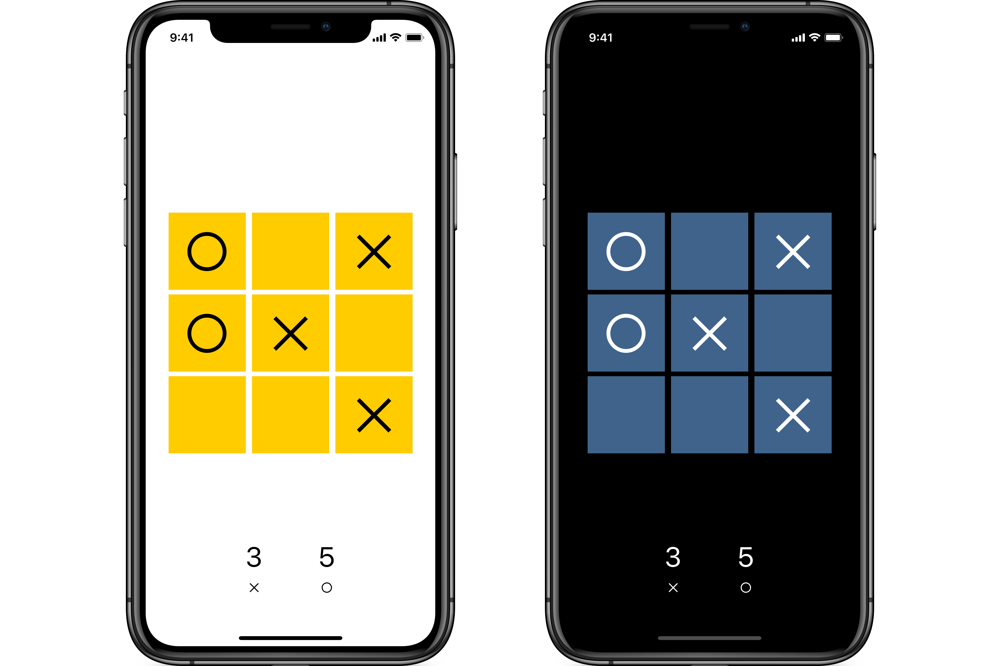

# TicTacToe

Crea una versión jugable del tres en raya para iOS.

## Requisitos

El interfaz de usuario deberá tener este aspecto:



El juego continua hasta que uno de los dos jugadores gana o haya empate, cuando se vuelve a empezar.

## Restricciones

Utiliza _stack views_ y crea las _constraints_ necesarias para que el interfaz sea lo más parecido posible al del ejemplo, con el grupo de botones en el centro de la pantalla y el marcador anclado al borde inferior.

Siguiendo el patrón MVC, utiliza un array de 3x3 enteros para representar el estado del juego, comprobar si hay ganador en cada tirada y actualizar el interfaz como corresponda.

Sólo vamos a desarrollar la orientación en vertical.

## Sugerencias

Los caracteres Unicode del ejemplo son `✕` y `○`.

Para mostrar un mensaje modal cuando se termine la partida, usa un `UIAlertController`:

```swift
let alertController = UIAlertController(title: "Fin del juego",
                                        message: "Ha ganado ✕",
                                        preferredStyle: .alert)

self.present(alertController, animated: true, completion: nil)
``` 
